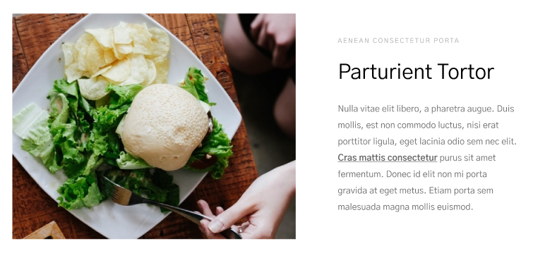

# Бэм
## Задание 1
head
head__ear
head__ear--size_big
body
body__abs
body__abs--amount_six
legs
legs--positioin_left
legs__knees
## Задание 2
### Форма 

form.form>h2.form__title+p.form__descr+label.form__label+input.form__input+btn.form__btn
### Header

header.header>img.header__logo+ul.header__list.list>li.list__item*4
### Card

.card>img.card__img+.card__wrapper>p.card__subtitle+h3.card__title+p.card__descr>span.card__span
### Footer

footer.footer>img.footer__logo+ul.footer__list>li.footer__link